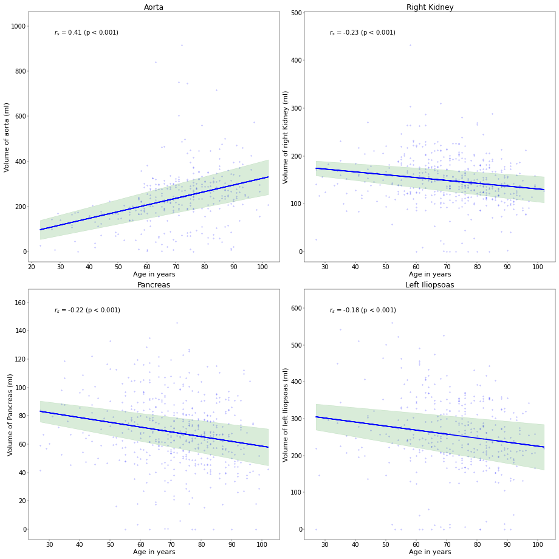
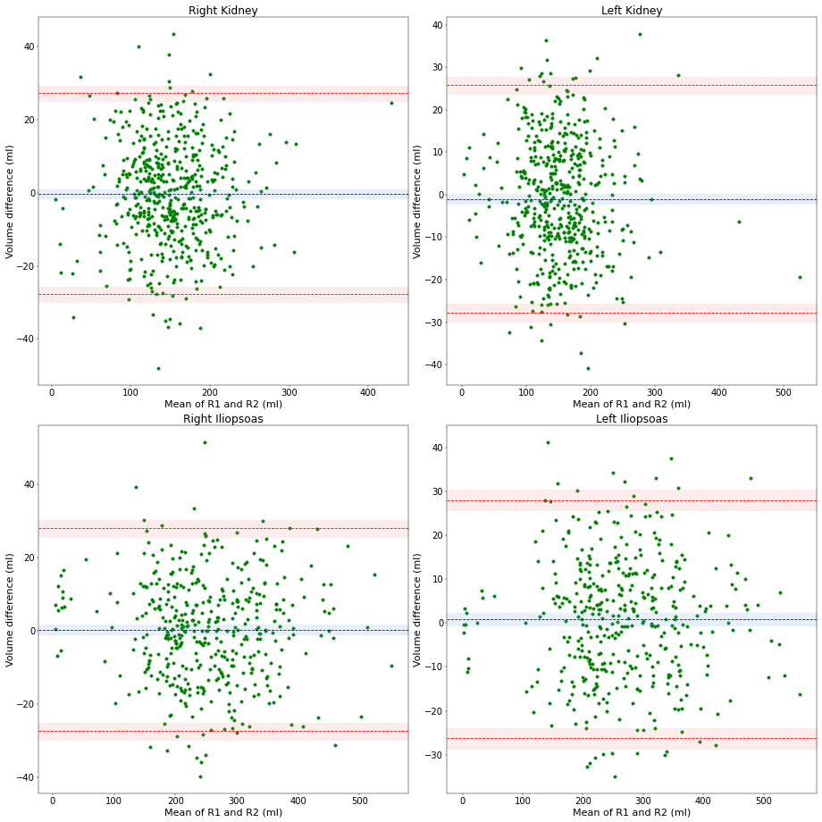

# Statsmed

Statsmed is designed to perform statistical analysis of medical data, but may also be used for various other datasets. It gives you an fast overview of your data and allows you to perform tests and create figures. 
There are examples for some functions.

- [Example 1](https://github.com/segemart/statsmed/blob/main/examples/example1/Tests_normal_distribution.ipynb) - Test for normal distribution
- [Example 2](https://github.com/segemart/statsmed/blob/main/examples/example2/DescriptiveStatistic.ipynb) - Descriptive Statistic - Mean; Confidence Interval - Median; Inter-quartile range
- [Example 3](https://github.com/segemart/statsmed/blob/main/examples/example3/Correlations.ipynb) - Pearson's and Spearman's correlation with figures
- [Example 4](https://github.com/segemart/statsmed/blob/main/examples/example4/Comparision_continuous.ipynb) - Comparison of two groups with continuous variables
- [Example 5](https://github.com/segemart/statsmed/blob/main/examples/example5/Bland-Altman-Plots.ipynb) - Bland-Altman plots

For some special usecases we also implementet a functional t-test, where you can compare two groups of functions.

- [Special Example 1](https://github.com/segemart/statsmed/blob/main/examples/special_example1/Functional_t_test.ipynb) - Bland-Altman plots


### Installation

Statsmed works on Ubuntu, Mac, and Windows and on CPU and GPU.

Please make sure you have a running version of Python (>= 3.8.8), pip and git.

Install Statsmed
```
pip install git+https://github.com/segemart/statsmed.git
```

### Goal

The idea was that you can perform quickly basic medical data analysis and create some figures. We will add more functions and create more examples. If you have ideas for improvement please contact us (martin.segeroth@usb.ch).

### Usage

Statsmed also allows you to generate figures quickly. See for example [Example 3](https://github.com/segemart/statsmed/blob/main/examples/example3/Correlations.ipynb) or [Example 5](https://github.com/segemart/statsmed/blob/main/examples/example5/Bland-Altman-Plots.ipynb), where we generated plots to show some correlations and Bland-Altman plots.



