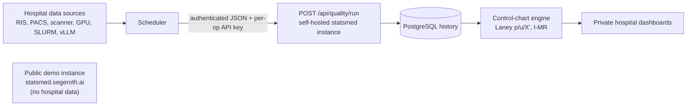

# RSNA 2026 — Scientific Abstract

Standard RSNA scientific abstract structure: **Purpose / Methods and Materials / Results / Conclusion**, followed by a separate **Clinical Relevance / Application** statement that is printed as part of the abstract. Body ≤ 2,200 characters incl. spaces. Clinical Relevance / Application ≤ 200 characters. Submission must be blinded — no author/site identifiers in title, body or figure. The text below is blinded; the deployment site is referred to as "a tertiary university hospital radiology department".

---

## RSNA 2026 submission requirements (what the abstract must satisfy)

Source: [RSNA 2026 Abstract Submission](https://www.rsna.org/annual-meeting/abstract-submission) and the published RSNA Abstract Submission Guidelines. RSNA 2026 takes place 29 Nov – 3 Dec 2026 in Chicago; the **abstract submission deadline is 6 May 2026, 12:00 CT**, via the online portal.

**Category and track.** RSNA accepts abstracts under two categories: **Science** (hypothesis-driven research, presented as oral paper or digital/scientific poster) and **Education** (education exhibits). Quality Improvement Reports are submitted under Science → **Noninterpretive Skills (Beyond Imaging)**. This work is being submitted as a **Scientific Abstract** under Science; the operational/QC content would also be admissible as a Quality Improvement Report, but only one track is chosen at submission.

**Required structure (Scientific Abstract).** Body must use the four mandated section headings **Purpose, Materials and Methods, Results, Conclusion** in that order, written as continuous text (no bullet lists in the portal). Body length is capped at **2,200 characters including spaces** (some published RSNA guideline editions list up to 2,400; the portal counter is authoritative — we keep ≤ 2,200 to be safe).

**Clinical Relevance / Application statement.** A separate statement of **≤ 200 characters incl. spaces** is **required**, entered in its own portal field, and printed with the abstract. It must state the clinical/operational impact, not repeat the conclusion verbatim.

**Title.** **≤ 100 characters incl. spaces**, descriptive, no author or institution identifiers, no proprietary product names where avoidable.

**Double-blind peer review (mandatory blinding).** All submissions are reviewed double-blind. Remove every author name, institution name, department name, city, country, hospital/clinic name, funding-source identifier, ethics-committee number that reveals the site, and any other identifier from the **title, body, figure(s) and figure captions**. Substitute generic descriptors (e.g. "a tertiary university hospital radiology department"). Author affiliations are entered only in the RSNA author-metadata fields, never in the abstract body.

**HIPAA / data protection.** No patient names, medical record numbers, dates of birth, accession numbers, full study dates that could re-identify a patient, or identifiable images. Anonymise screenshots and dashboard captures.

**Figure.** A single figure is **recommended (not required)** for Scientific Abstracts; **required** for Quality Improvement Reports. Single file, **JPG** for Scientific Abstracts (PDF for QI), one composite image allowed, all axes and labels in English, no logos, no identifiers, legible at print resolution.

**Disclosures.** ACCME financial-disclosure declarations are mandatory for every author and presenter and are entered in the author metadata; refusal to disclose disqualifies the submission. Disclosures do not go into the abstract body.

**Awards eligibility (informational).** Trainee Research Prizes require the presenter to be an RSNA Member-in-Training; the Kuo York Chynn award covers neuroradiology. Neither applies to a presenter outside those criteria, but both are determined from author metadata, not from the abstract text.

What this means for the document below: title ≤ 100 char, body ≤ 2,200 char with the four mandated headings, a ≤ 200-char Clinical Relevance statement, fully blinded language and figure, single composite JPG, all author/site identifiers stripped before paste-in.

---

## Story

Statsmed is open source — anyone can run it in their hospital (as we did), and it is also openly deployed (statsmed.segeroth.ai), but no hospital data goes to that public instance. It can be used both for statistical analysis in research and for statistical quality control. Current quality-control streams include things like examinations written in one hour by a trainee, or examinations performed in one hour at an MRI scanner; we also monitor things like the GPU usage of our server and whether a local LLM is available and works. For more examples please see the hospital-side scripts in /Users/martinsegeroth/Documents/Git_repos/statsmed-usb.

The idea is that statsmed can be used for online quality control, so that the effects of changes in clinical procedures are noticed directly. It is there to protect workers from unrealistic expectations and to identify flaws in the current workflows — not to blame individual people.

In the future we plan to intensify the LLM assessment by using benchmarks and similar evaluations rather than only a simple availability check, and to monitor the text data generated in the organisation: are there shifts in formulations, are the data getting more consistent or less, is the output getting better, etc.


## Title (≤ 100 char)

Primary (preferred — names the project; 99 char):

1. Statsmed: An Open-Source Application for Online Clinical Quality Monitoring and Research Statistics


---

## Abstract body (≤ 2,200 char incl. spaces)

**Purpose.** To develop and deploy an open-source application that combines a statistical workbench for clinical research with online quality control of radiology workflows and local artificial-intelligence services. The system was designed to surface workflow changes early, identify process flaws and give staff the possibility to address structural problems.

**Methods and Materials.** The application is a Python statistics library and a web service (FastAPI, PostgreSQL, Next.js) accepting authenticated JSON payloads from scheduled scripts, with a prospective Laney and individual moving-range control-chart engine. It is self-hostable. A separate public instance demonstrates it without exposing hospital data. In a tertiary university hospital radiology department, scripts queried radiology information systems, image archives, scanners, graphics processors, job schedulers and a local large-language-model service. Aggregates were stored in PostgreSQL and shown on private dashboards. Monitored streams covered report turnaround, examination duration, scanner throughput, examinations per reporting hour, coding completeness, archive ingestion, graphics-processor use, AI job load and local model availability and latency.

**Results.** Eleven monitoring streams were deployed. By 30 April 2026, 4,592 ingestions had been performed, 4,591 successfully (99.98%), storing 5,112,451 rows; 66 control charts produced 18,643 points. Nine clinical/operational streams (53 charts) produced 105 reviewable out-of-control signals, concentrated in report turnaround, exam duration and scanner throughput. Infrastructure streams flagged graphics-processor saturation, AI job-load peaks and local model latency excursions.

**Conclusion.** An open-source application can combine research statistics with continuous, self-hostable quality monitoring of radiology operations and local AI services. Early deployment showed reliable data capture and interpretable signals for workflow disruption, fair workload assessment and prospective AI-service surveillance. Future work will extend AI monitoring beyond availability to benchmark-based evaluation and drift surveillance of locally generated text.

(2,182 characters incl. spaces; verify with `wc -m` after any edit. Limit ≤ 2,200.)

---

## Clinical Relevance / Application (≤ 200 char) — printed with the abstract

> Open-source online quality control detects radiology workflow disruption and local AI-system issues while supporting fair, non-punitive workload assessment.

(156 characters incl. spaces; verify with `wc -m` after any edit. Limit ≤ 200.)

---

## Suggested figure (single .jpg, blinded)

Composite figure with two panels, all axes labelled in English, no patient/staff identifiers, no logos:

- **Panel A — architecture.** Data sources (RIS/PACS, scanners, GPU servers, AI workload jobs, local-LLM probe) → authenticated JSON push via per-operation API key → `POST /api/quality/run` → PostgreSQL history → prospective Laney / I-MR control-chart engine → private dashboards in the hospital, plus a separately deployed public demo instance that does not receive hospital data.
- **Panel B — local AI control chart.** "vLLM Apollo — Image Processing Time" demonstrating the same SPC engine applied to an AI-serving signal, with out-of-control points marked.

If only one panel is wanted, keep Panel A (architecture) and drop Panel B.

---

## Mermaid data-flow diagram (for the user only, NOT for the RSNA submission)



---

## Numbers used in the body (from production Postgres + public API, through 2026-04-30)

| Metric | Value | Source |
|---|---|---|
| Monitoring span | stream-specific starts, last sample 2026-04-30 | Postgres |
| Operations (all public) | 11 | public API dump |
| Functions (total / control-chart) | 71 / 66 | runtime / public API |
| Runs / pass-rate | 4,592 / 99.98 % | Postgres |
| Rows ingested | 5,112,451 | Postgres |
| Longitudinal control-chart points | 18,643 | public API dump |
| Out-of-control points detected | 6,663 | public API dump |
| Clinical-operational control charts / OOC | 53 / 105 | public API dump (excl. ApolloGPU Usage 11/6,398 and vLLM Apollo 2/110) |
| Vignette 1 | MSK Report Times = 239.18 min on 2026-04-09 (control-chart OOC) | public API dump |
| Vignette 2 | CT Notfall Report Times — control-chart OOC on 2026-03-13 (18.91), 2026-03-23 (26.10), 2026-04-14 (39.58 min) | public API dump |

Per-operation breakdown from the public API dump (`RSNA_abstract-Data.txt`):

| id | operation | control charts | points | OOC | type |
|---:|---|---:|---:|---:|---|
| 1  | ICD10-Control                | 1  | 53    | 1     | laney_p_chart |
| 4  | Examination Length           | 13 | 653   | 22    | laney_x_chart |
| 5  | Report Times                 | 8  | 488   | 29    | laney_x_chart |
| 6  | Examinations per Writertime  | 5  | 190   | 3     | laney_u_chart |
| 7  | Examinations per Scannertime | 13 | 645   | 19    | laney_u_chart |
| 8  | vLLM Apollo                  | 2  | 6,628 | 110   | i_mr_chart |
| 9  | ApolloGPU Usage              | 11 | 9,647 | 6,448 | laney_x_chart |
| 10 | Apollo Job Load              | 1  | 47    | 16    | laney_u_chart |
| 11 | Examinations per Seniortime  | 5  | 190   | 4     | laney_u_chart |
| 12 | DICOMcrawl per PACSTime      | 5  | 36    | 6     | laney_u_chart |
| 13 | OmniScanPerformance          | 2  | 66    | 5     | laney_u_chart |

The 6,663 OOC count is dominated by hourly GPU/LLM infrastructure charts (ApolloGPU Usage = 6,448; vLLM Apollo = 110). The clinically focused subset — nine clinical/operational operations (excluding ApolloGPU Usage and vLLM Apollo) covering 53 control charts — yields 105 OOC signals; this is the framing used in the body. "AI-triage acceptance" was removed from the abstract because it is not one of the 11 deployed operations in the public dump.

---

## Useful commands to inspect the data

Server/API command (best match to the public dashboard because it uses the enriched public endpoint):

```bash
BASE="${BASE:-http://127.0.0.1:8000}"
OUT="/tmp/statsmed_public"
mkdir -p "$OUT"
curl -sf "$BASE/api/quality/public" | jq -r '.[].id' > "$OUT/ids.txt"
while read -r id; do
  curl -sf "$BASE/api/quality/public/$id" > "$OUT/op_${id}.json"
done < "$OUT/ids.txt"

jq -s '
  [.[].latest_run.results[]?
   | select(.chart_data.type | IN("laney_p_chart","laney_u_chart","laney_x_chart","i_mr_chart"))] as $charts
  | [.[]
     | {id, name,
        charts: ([.latest_run.results[]?
          | select(.chart_data.type | IN("laney_p_chart","laney_u_chart","laney_x_chart","i_mr_chart"))])}
     | {id, name,
        charts: (.charts | length),
        points: ([.charts[].chart_data.points[]?] | length),
        out_of_control: ([.charts[].chart_data.points[]? | select(.out_of_control == true)] | length)}
    ],
    {total_charts: ($charts | length),
     total_points: ([$charts[].chart_data.points[]?] | length),
     total_out_of_control: ([$charts[].chart_data.points[]? | select(.out_of_control == true)] | length)}
' "$OUT"/op_*.json
```

-- Results

```text
[
  {
    "id": 10,
    "name": "Apollo Job Load",
    "charts": 1,
    "points": 47,
    "out_of_control": 16
  },
  {
    "id": 11,
    "name": "Examinations per Seniortime",
    "charts": 5,
    "points": 190,
    "out_of_control": 4
  },
  {
    "id": 12,
    "name": "DICOMcrawl per PACSTime",
    "charts": 5,
    "points": 36,
    "out_of_control": 6
  },
  {
    "id": 13,
    "name": "OmniScanPerformance",
    "charts": 2,
    "points": 66,
    "out_of_control": 5
  },
  {
    "id": 1,
    "name": "ICD10-Control",
    "charts": 1,
    "points": 53,
    "out_of_control": 1
  },
  {
    "id": 4,
    "name": "Examination Length",
    "charts": 13,
    "points": 653,
    "out_of_control": 22
  },
  {
    "id": 5,
    "name": "Report Times",
    "charts": 8,
    "points": 488,
    "out_of_control": 29
  },
  {
    "id": 6,
    "name": "Examinations per Writertime",
    "charts": 5,
    "points": 190,
    "out_of_control": 3
  },
  {
    "id": 7,
    "name": "Examinations per Scannertime",
    "charts": 13,
    "points": 645,
    "out_of_control": 19
  },
  {
    "id": 8,
    "name": "vLLM Apollo",
    "charts": 2,
    "points": 6628,
    "out_of_control": 110
  },
  {
    "id": 9,
    "name": "ApolloGPU Usage",
    "charts": 11,
    "points": 9647,
    "out_of_control": 6448
  }
]
{
  "total_charts": 66,
  "total_points": 18643,
  "total_out_of_control": 6663
}
```


Database command (useful for run volume and ingestion reliability; chart limits are recomputed by the API):

```bash
docker exec -i statsmed_postgres psql -U "${POSTGRES_USER:-statsmed}" -d "${POSTGRES_DB:-statsmed}" <<'SQL'
SELECT
  o.id,
  o.name,
  count(r.id) AS runs,
  sum(r.row_count) AS rows_ingested,
  count(*) FILTER (WHERE r.success) AS successful_runs,
  min(coalesce(r.sample_date, r.created_at)) AS first_sample,
  max(coalesce(r.sample_date, r.created_at)) AS last_sample
FROM quality_control_operations o
JOIN quality_control_runs r ON r.operation_id = o.id
WHERE o.is_public = true
GROUP BY o.id, o.name
ORDER BY o.name;
SQL
```

-- result

```text
jupyter@ictjupylblk01:~$ docker exec -i statsmed_postgres psql -U "${POSTGRES_USER:-statsmed}" -d "${POSTGRES_DB:-statsmed}" <<'SQL'
SELECT
  o.id,
  o.name,
  count(r.id) AS runs,
  sum(r.row_count) AS rows_ingested,
  count(*) FILTER (WHERE r.success) AS successful_runs,
  min(coalesce(r.sample_date, r.created_at)) AS first_sample,
  max(coalesce(r.sample_date, r.created_at)) AS last_sample
FROM quality_control_operations o
JOIN quality_control_runs r ON r.operation_id = o.id
WHERE o.is_public = true
GROUP BY o.id, o.name
ORDER BY o.name;
SQL
 id |             name             | runs | rows_ingested | successful_runs |    first_sample     |     last_sample     
----+------------------------------+------+---------------+-----------------+---------------------+---------------------
 10 | Apollo Job Load              |   47 |            47 |              47 | 2026-03-14 00:00:00 | 2026-04-29 00:00:00
  9 | ApolloGPU Usage              |  877 |       5042535 |             877 | 2026-03-14 17:00:00 | 2026-04-30 14:00:00
 12 | DICOMcrawl per PACSTime      |    9 |             9 |               9 | 2026-04-21 00:00:00 | 2026-04-29 00:00:00
  4 | Examination Length           |   62 |         33253 |              62 | 2026-02-27 00:00:00 | 2026-04-29 00:00:00
  7 | Examinations per Scannertime |   59 |            59 |              59 | 2026-03-02 00:00:00 | 2026-04-29 00:00:00
 11 | Examinations per Seniortime  |   38 |            38 |              38 | 2026-03-23 00:00:00 | 2026-04-29 00:00:00
  6 | Examinations per Writertime  |   38 |            38 |              38 | 2026-03-23 00:00:00 | 2026-04-29 00:00:00
  1 | ICD10-Control                |   54 |         25882 |              53 | 2026-02-25 00:00:00 | 2026-04-29 00:00:00
 13 | OmniScanPerformance          |   33 |            33 |              33 | 2026-03-28 00:00:00 | 2026-04-29 00:00:00
  5 | Report Times                 |   61 |         10557 |              61 | 2026-02-28 00:00:00 | 2026-04-29 00:00:00
  8 | vLLM Apollo                  | 3314 |             0 |            3314 | 2026-04-07 10:40:00 | 2026-04-30 15:10:00
(11 rows)

jupyter@ictjupylblk01:~$ 
```


---

## Submission checklist

- [ ] Pick a title (Title 1, primary, with project name = 99 char; Title 2, blinded fallback = 89 char; both ≤ 100) and paste it into the RSNA portal title field. If the reviewers' double-blind interpretation is strict about project names, prefer Title 2.
- [ ] Paste the single Abstract body (Purpose / Methods and Materials / Results / Conclusion; currently 2,182 char) into the RSNA portal body field; re-confirm ≤ 2,200 with the portal counter.
- [ ] Paste the Clinical Relevance / Application statement (currently 156 char) into the corresponding portal field; re-confirm ≤ 200.
- [ ] Confirm the body retains the four mandated section labels (Purpose, Methods and Materials, Results, Conclusion) without bold markdown if the portal does not render Markdown.
- [ ] Strip the figure description, Mermaid block, numbers table and this checklist before submission — only title, body, Clinical Relevance and the .jpg figure go into the portal.
- [ ] Generate the .jpg from the live dashboard with all titles in English and all author/site identifiers removed.
- [ ] Disclose author affiliations only in the RSNA author metadata fields, not in the abstract body.
